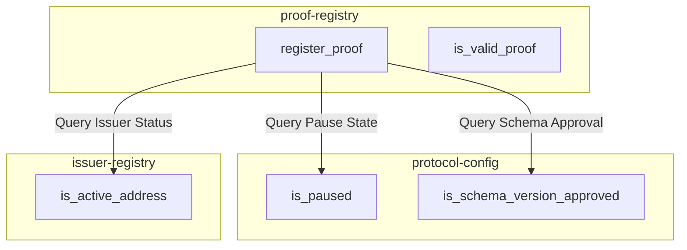

# Contract Invariants and State Specifications

This directory defines the formal state machine specifications, invariants, transition matrices, guards, and security boundaries across the EarnProof smart contract system on Soroban.

Rust source code is authoritative for on-chain enforcement; these documents provide the formal specification for auditors, maintainers, and integrators. All code and test references in this directory are verified automatically via `scripts/check-doc-links.py`.

---

## Contract State Machines

The EarnProof architecture comprises three core contracts, each managing distinct state lifecycles:

1. **[Protocol Configuration](protocol-config.md)**: Governs global operational controls including administrator identity, emergency pause containment, schema version approvals, and monotonic contract upgrade allowlists.
2. **[Issuer Registry](issuer-registry.md)**: Manages issuer lifecycles (`Active` → `Suspended` ↔ `Active`, and terminal `Revoked`), address mappings, reverse lookups, and upgrade governance.
3. **[Proof Registry](proof-registry.md)**: Manages income and employment proof commitments (`Absent` → `Active`, temporal `Expired`, and terminal `Revoked`), issuer/admin revocations, validity evaluations, and cross-contract gating.

---

## System Enforcement Boundary

| Domain | Responsible Entity | Enforced Guarantees |
| :--- | :--- | :--- |
| **On-Chain Contracts** | Soroban Runtime | - Single initialization per contract instance - Strict cryptographic authorization (`require_auth`) - Replay and duplicate prevention via unique storage keys - Status transition validations and terminal state immutability - Monotonic upgrade versioning and allowlist consumption - Fail-closed cross-contract verification - Storage and instance TTL management - Atomic rollback on rejected operations |
| **Off-Chain Backend & Client** | EarnProof Service | - Pre-computation of SHA-256 identifier and commitment hashes - Secure off-chain storage of sensitive payroll and identity data - Due diligence and vetting before issuer registration - Selection of active, approved schema versions - Querying proof validity at verification time without stale caching - Monitoring and proactive extension of contract storage TTLs |

---

## Cross-Contract Dependency Model

The `proof-registry` contract depends on `protocol-config` and `issuer-registry` for registration gating:

### Cross-Contract Invariants & Assumptions

1. **Reference Immutability**: Cross-contract addresses (`protocol_config`, `issuer_registry`) are recorded during `contracts/proof-registry/src/lib.rs::initialize` in instance storage and cannot be altered at runtime.
2. **Fail-Closed Execution**: If any dependency is uninitialized, missing, incompatible, paused, or returns false, proof registration aborts immediately (`contracts/proof-registry/src/lib.rs::register_proof`).
3. **Atomic Rollback**: In accordance with Soroban invocation semantics, a failed cross-contract call rolls back all state changes, emits no events, and extends no TTLs (`tests/cross-contract/src/boundaries.rs::a_rejected_pause_read_leaves_no_proof_record`, `tests/events/src/ghost.rs::a_rejected_call_changes_neither_events_nor_storage`).
4. **Evaluation Priority**: Revocation dominates temporal expiration; a revoked proof is permanently invalid regardless of expiration timestamp (`tests/time/src/lib.rs::revocation_dominates_expiration`).

---

## Privacy Invariants

To protect employee and employer data:
- **No Cleartext PII or Financial Data**: Storage and event topics/data contain only 32-byte cryptographic hashes (`BytesN<32>`), public Stellar `Address` keys, monotonic integer counters/versions, status enums, and ledger timestamps (`u64`).
- **No Income or Payment History**: Salary figures, payment frequencies, transaction amounts, and identity records never touch contract parameters, storage, or events.
- **Reverse Index Scope**: Reverse address mappings in `issuer-registry` serve solely as public authorization and routing keys.
- **Verified Event Payloads**: Negative event tests confirm that rejected operations and internal error details never leak private data (`tests/events/src/ordering.rs::no_event_payload_carries_protected_data`, `tests/events/src/ghost.rs::a_rejected_call_changes_neither_events_nor_storage`).

---

## Security Property Mapping

For comprehensive threat analysis, attack surface categorization, and risk mitigations, see the [Contract Threat Model](../threat-model.md):
- **Authorization Enforcement**: [Threat Model - T1: Authorization Bypass](../threat-model.md#t1-authorization-bypass)
- **Replay & Duplicate Prevention**: [Threat Model - T2: Duplicate Registration](../threat-model.md#t2-duplicate-registration-replay-attacks)
- **Issuer Trust & Validation**: [Threat Model - T3: Malicious Issuer Behavior](../threat-model.md#t3-malicious-issuer-behavior)
- **Privileged Admin Controls**: [Threat Model - T4: Compromised Admin Key](../threat-model.md#t4-compromised-admin-key)
- **Pause & Emergency Controls**: [Threat Model - T5: Protocol Pause Abuse](../threat-model.md#t5-protocol-pause-abuse--denial-of-service)
- **Cross-Contract References**: [Threat Model - T6: Stale Cross-Contract References](../threat-model.md#t6-stale-cross-contract-references)
- **Storage Lifecycle & TTL**: [Threat Model - T7: TTL Expiration and Data Loss](../threat-model.md#t7-ttl-expiration-and-data-loss)
- **State Transition Integrity**: [Threat Model - T8: Invalid State Transitions](../threat-model.md#t8-invalid-state-transitions)
- **Time & Validity Semantics**: [Threat Model - T9: Expired Proof Acceptance](../threat-model.md#t9-expired-proof-acceptance) and [Time Semantics](../time-semantics.md)
