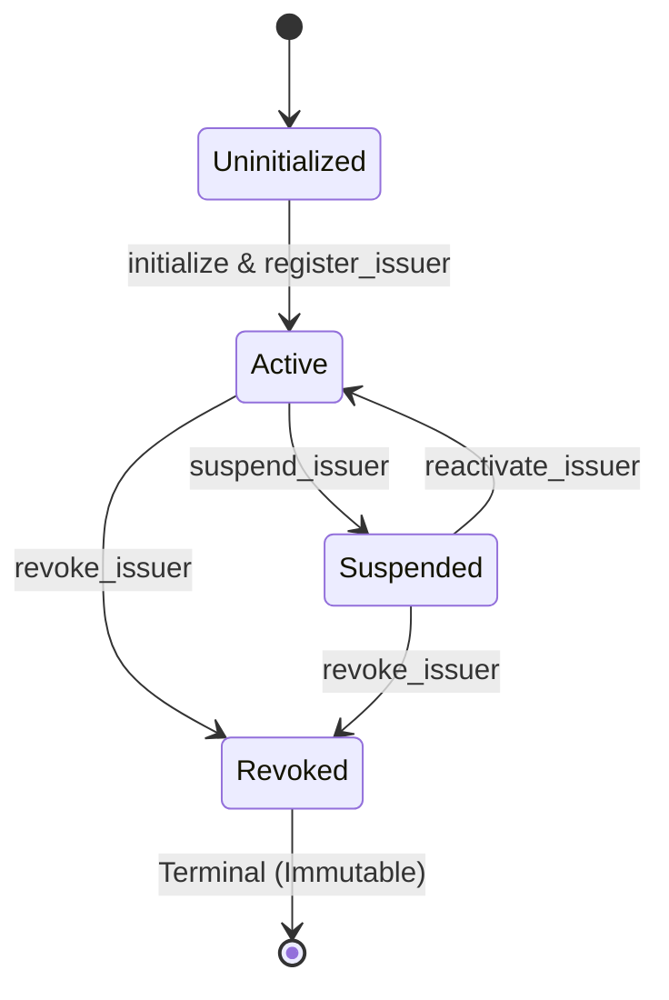

# Issuer Registry Specification

## Overview & State Model

The `issuer-registry` contract maintains authorized identity commitments, public Stellar signing addresses, metadata hashes, and operational statuses for institutional credential issuers.

### Core States
- **Uninitialized**: Contract instance exists but has no configured administrator.
- **Active**: Issuer is fully authorized to issue and register proofs; address is mapped and active.
- **Suspended**: Issuer is temporarily blocked from registering new proofs; existing proofs remain valid until expiration or revocation. Can be reactivated to `Active`.
- **Revoked (Terminal State)**: Issuer is permanently decommissioned. A revoked issuer can never transition back to `Active` or `Suspended`, cannot update metadata, and cannot rotate addresses.
- **Reverse Address Index**: Each registered issuer address is uniquely bound to exactly one issuer ID hash via `AddressIssuer(address) -> issuer_id_hash`.

---

## State Transition Matrix

| Transition / Method | Source State | Target State | Guard / Authorization | State Mutations & Side Effects | Emitted Event | Impossible Transitions & Errors |
| :--- | :--- | :--- | :--- | :--- | :--- | :--- |
| `initialize` | Uninitialized | Initialized | `DataKey::Admin` absent; `admin` authenticates | Stores `Admin`, sets `ContractVersion = 1` | `Initialized` | Re-initialization: `ContractError::AlreadyInitialized`; unauthenticated caller |
| `register_issuer` | Non-Existent | `Active` | Current admin authenticates; `issuer_id_hash` absent; `issuer_address` absent | Creates `Issuer(id)` record with `status = Active`; creates `AddressIssuer(addr)` index; extends TTLs | `IssuerRegistered` | Duplicate issuer ID: `IssuerAlreadyExists`; duplicate address: `IssuerAlreadyExists`; unauthorized caller |
| `update_issuer` | `Active` / `Suspended` | Same State | Current admin authenticates; issuer exists; `status != Revoked` | Updates `metadata_hash` and `updated_at = now`; extends TTL | `IssuerMetadataUpdated` | Revoked issuer: `IssuerError::IssuerNotFound`; missing issuer: `IssuerNotFound`; unauthorized caller |
| `suspend_issuer` | `Active` / `Suspended` | `Suspended` | Current admin authenticates; issuer exists; `status != Revoked` | Sets `status = Suspended`, `updated_at = now`; extends TTL | `IssuerSuspended` | Revoked issuer: `IssuerError::InvalidTransition`; missing issuer: `IssuerNotFound`; unauthorized caller |
| `reactivate_issuer` | `Suspended` / `Active` | `Active` | Current admin authenticates; issuer exists; `status != Revoked` | Sets `status = Active`, `updated_at = now`; extends TTL | `IssuerReactivated` | Revoked to Active: `IssuerError::InvalidTransition`; missing issuer: `IssuerNotFound`; unauthorized caller |
| `revoke_issuer` | `Active` / `Suspended` / `Revoked` | `Revoked` | Current admin authenticates; issuer exists | Sets `status = Revoked`, `updated_at = now`; extends TTL | `IssuerRevoked` | Missing issuer: `IssuerError::IssuerNotFound`; unauthorized caller |
| `rotate_issuer_address` | `Active` / `Suspended` | Same State | Current admin authenticates; issuer exists; `status != Revoked`; `new_address` absent | Removes old `AddressIssuer(old)`, writes `AddressIssuer(new)`, updates `issuer_address` and `updated_at`; extends TTL | `IssuerAddressRotated` | Address already in use: `IssuerAlreadyExists`; revoked issuer: `IssuerNotFound`; unauthorized caller |
| `approve_upgrade` | Initialized | Allowlisted | Current admin authenticates; `new_version > ContractVersion` | Sets `AllowedWasm(wasm_hash) = new_version`, extends instance TTL | `UpgradeAllowlisted` | Version downgrade (`new_version <= ContractVersion`); unauthorized caller |
| `revoke_upgrade` | Allowlisted | Absent | Current admin authenticates | Removes `AllowedWasm(wasm_hash)` | `UpgradeRevoked` | Unauthorized caller |
| `upgrade_contract` | Allowlisted | Initialized (New WASM) | Current admin authenticates; `wasm_hash` in allowlist; `target_version > ContractVersion` | Consumes allowlist entry, updates contract WASM, sets `ContractVersion = new_version` | `ContractUpgraded` | Non-allowlisted WASM hash; replay of consumed hash; version downgrade |

---

## Invariants & Safety Guarantees

1. **Terminality of Revocation**: Once an issuer reaches `IssuerStatus::Revoked`, no subsequent operation can restore it to `Active` or `Suspended` (`contracts/issuer-registry/src/lib.rs::set_status`).
2. **Reverse Index Bijectivity**: Every active and suspended issuer address maps to exactly one issuer record. No two issuers can share an address, and an address cannot be reused after rotation while allocated.
3. **Admin Exclusivity**: Only the authorized administrator can create, modify, suspend, reactivate, revoke, or rotate issuers (`contracts/issuer-registry/src/lib.rs::require_auth`). Issuer signatures cannot modify or revoke issuer records.
4. **State Preservation Across Upgrades**: Contract state (issuers, reverse indices, admin) is preserved intact across WASM bytecode upgrades.

---

## Code and Test Linkage

### Implementation References
- Core Lifecycle: `contracts/issuer-registry/src/lib.rs::register_issuer`, `contracts/issuer-registry/src/lib.rs::update_issuer`, `contracts/issuer-registry/src/lib.rs::set_status`, `contracts/issuer-registry/src/lib.rs::suspend_issuer`, `contracts/issuer-registry/src/lib.rs::reactivate_issuer`, `contracts/issuer-registry/src/lib.rs::revoke_issuer`
- Address Management: `contracts/issuer-registry/src/lib.rs::rotate_issuer_address`, `contracts/issuer-registry/src/lib.rs::get_issuer_by_address`, `contracts/issuer-registry/src/lib.rs::is_active_address`
- Upgrade Governance: `contracts/issuer-registry/src/lib.rs::approve_upgrade`, `contracts/issuer-registry/src/lib.rs::revoke_upgrade`, `contracts/issuer-registry/src/lib.rs::upgrade_contract`

### Positive Test Coverage
- `contracts/issuer-registry/src/lib.rs::registers_and_reads_active_issuer`: Verifies registration and status retrieval.
- `contracts/issuer-registry/src/lib.rs::extends_issuer_storage_ttl`: Verifies storage TTL extension on read and mutation.
- `contracts/issuer-registry/src/lib.rs::register_issuer_emits_one_event`: Verifies event emission on registration.
- `contracts/issuer-registry/src/lib.rs::update_issuer_emits_one_event`: Verifies metadata updates and event emission.
- `contracts/issuer-registry/src/lib.rs::suspend_issuer_emits_one_event`: Verifies suspension transition.
- `contracts/issuer-registry/src/lib.rs::reactivate_issuer_emits_one_event`: Verifies reactivation transition.
- `contracts/issuer-registry/src/lib.rs::revoke_issuer_emits_one_event`: Verifies revocation transition.
- `contracts/issuer-registry/src/lib.rs::rotate_address_emits_one_event`: Verifies address rotation and reverse index remapping.
- `contracts/issuer-registry/src/lib.rs::upgrade_advances_version_and_consumes_allowlist`: Verifies upgrade execution.
- `tests/property/state_machine.rs::issuer_status_never_reactivates_after_revoke`: Property-based fuzz test verifying revocation terminality invariant over random operation sequences.

### Negative & Rejection Test Coverage
- `contracts/issuer-registry/src/lib.rs::rejects_duplicate_issuer_id`: Asserts registration fails if issuer ID already exists.
- `contracts/issuer-registry/src/lib.rs::revoked_issuer_cannot_be_reactivated`: Asserts `reactivate_issuer` returns `IssuerError::InvalidTransition` on revoked issuer.
- `contracts/issuer-registry/src/lib.rs::status_transitions_reject_reactivated_revoked_issuer`: Asserts full rejection across status transition matrix for revoked entities.
- `contracts/issuer-registry/src/lib.rs::update_revoked_issuer_emits_no_event`: Asserts metadata update is rejected for revoked issuer.
- `contracts/issuer-registry/src/lib.rs::rotate_revoked_issuer_address_emits_no_event`: Asserts rotation is rejected for revoked issuer.
- `contracts/issuer-registry/src/lib.rs::revoke_issuer_rejects_a_valid_signature_from_the_issuer_itself`: Verifies issuer cannot self-revoke; admin signature strictly required.
- `contracts/issuer-registry/src/lib.rs::upgrade_contract_rejects_non_allowlisted_hash`: Asserts unapproved WASM upgrade rejection.
- `contracts/issuer-registry/src/lib.rs::upgrade_hash_cannot_be_replayed`: Asserts upgrade replay prevention.
- `tests/events/src/ghost.rs::suspended_issuer_registration_emits_no_event`: Asserts rejected registration emits zero events.
- `tests/events/src/ghost.rs::rotating_to_a_taken_address_emits_no_event`: Asserts rotating to an occupied address fails and emits zero events.

---

## Security Property Mapping

- **Authorization Enforcement**: [Threat Model - T1: Authorization Bypass](../threat-model.md#t1-authorization-bypass)
- **Duplicate Prevention**: [Threat Model - T2: Duplicate Registration](../threat-model.md#t2-duplicate-registration-replay-attacks)
- **Issuer Trust Model**: [Threat Model - T3: Malicious Issuer Behavior](../threat-model.md#t3-malicious-issuer-behavior)
- **State Transition Invariants**: [Threat Model - T8: Invalid State Transitions](../threat-model.md#t8-invalid-state-transitions)