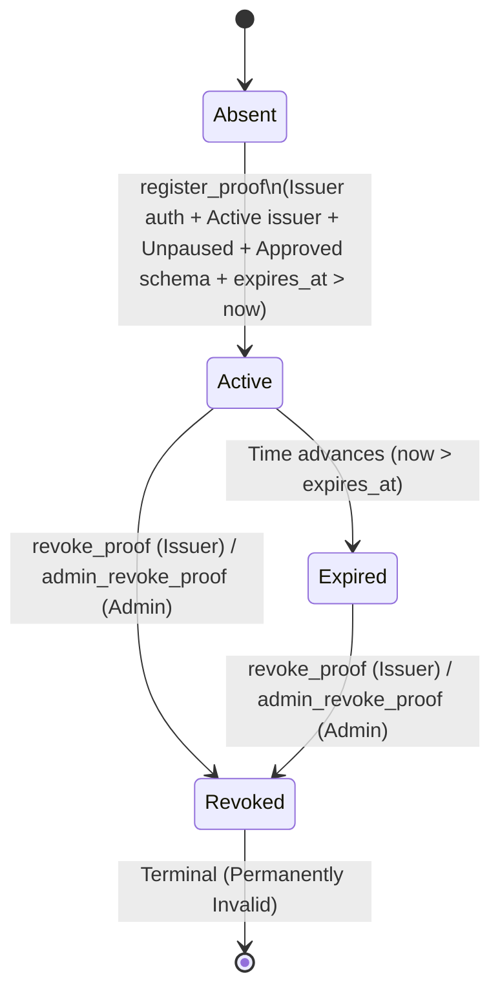

# Proof Registry Specification

## Overview & State Model

The `proof-registry` contract stores cryptographic commitments for employment and income credentials, handles multi-authority revocations (issuer or admin), evaluates temporal validity, and orchestrates cross-contract validation against `protocol-config` and `issuer-registry`.

### Core States
- **Absent**: No record exists for the given 32-byte `proof_id_hash`.
- **Active**: Proof commitment is recorded, unrevoked, and eligible for validation if current ledger timestamp `now <= expires_at`.
- **Expired (Temporal Dynamic State)**: Unrevoked proof whose ledger expiration timestamp has passed (`now > expires_at`). Validity evaluates to `false`. Record persists in storage for auditability until storage TTL expires or is renewed.
- **Revoked (Terminal State)**: Proof was revoked by either the issuing institution or the contract administrator. Once revoked, validity evaluates to `false` permanently regardless of expiration timestamp.
- **Upgrade Allowlist**: Stored mapping `AllowedWasm(wasm_hash) -> target_version` for bytecode upgrade authorization.

---

## State Transition Matrix

| Transition / Method | Source State | Target State | Guard / Authorization | State Mutations & Side Effects | Emitted Event | Impossible Transitions & Errors |
| :--- | :--- | :--- | :--- | :--- | :--- | :--- |
| `initialize` | Absent / Uninitialized | Initialized | `DataKey::Admin` absent; `admin` authenticates | Stores `Admin`, `IssuerRegistry`, `ProtocolConfig`, sets `ContractVersion = 1` | `Initialized` | Re-initialization: `ContractError::AlreadyInitialized`; unauthenticated caller |
| `register_proof` | Absent | `Active` | Issuer authenticates (`require_auth(&issuer_address)`); protocol unpaused; schema approved (`version > 0`); issuer address active; `expires_at > now`; `proof_id_hash` absent | Stores `ProofRecord` (`status = Active`, `created_at = now`, `expires_at`); extends instance & proof TTLs | `ProofRegistered` | Paused protocol: `ProofError::InvalidSchemaVersion`; unapproved/zero schema: `InvalidSchemaVersion`; inactive issuer: `ProofError::IssuerNotFound`; expired timestamp: `ProofError::ProofExpired`; duplicate ID: `ProofError::ProofAlreadyExists` |
| `revoke_proof` | `Active` | `Revoked` | Stored `issuer_address` authenticates; proof exists; `status != Revoked` | Sets `status = Revoked`, `revoked_at = now`; extends proof TTL | `ProofRevoked` | Non-existent proof: `ProofError::ProofNotFound`; already revoked: `ProofError::ProofAlreadyRevoked`; unauthorized caller |
| `admin_revoke_proof` | `Active` | `Revoked` | Current admin authenticates (`require_auth(&admin)`); proof exists; `status != Revoked` | Sets `status = Revoked`, `revoked_at = now`; extends proof TTL | `ProofRevoked` | Non-existent proof: `ProofError::ProofNotFound`; already revoked: `ProofError::ProofAlreadyRevoked`; unauthorized caller |
| `is_valid_proof` | Any | Query Only | None (Public view function) | None | None | Returns `false` for absent, revoked, or expired proofs; returns `true` strictly when `status == Active && now <= expires_at` |
| `approve_upgrade` | Initialized | Allowlisted | Current admin authenticates; `new_version > ContractVersion` | Sets `AllowedWasm(wasm_hash) = new_version`, extends instance TTL | `UpgradeAllowlisted` | Version downgrade (`new_version <= ContractVersion`); unauthorized caller |
| `revoke_upgrade` | Allowlisted | Absent | Current admin authenticates | Removes `AllowedWasm(wasm_hash)` | `UpgradeRevoked` | Unauthorized caller |
| `upgrade_contract` | Allowlisted | Initialized (New WASM) | Current admin authenticates; `wasm_hash` in allowlist; `target_version > ContractVersion` | Consumes allowlist entry, updates contract WASM, sets `ContractVersion = new_version` | `ContractUpgraded` | Non-allowlisted WASM hash; replay of consumed hash; version downgrade |

---

## Invariants & Safety Guarantees

1. **Strict Future Expiration at Registration**: A proof can only be registered if `expires_at > env.ledger().timestamp()` (`contracts/proof-registry/src/lib.rs::register_proof`).
2. **Inclusive Expiration Boundary**: A proof is valid at the exact boundary `ledger.timestamp() == expires_at`, and strictly invalid once `ledger.timestamp() > expires_at` (`tests/time/src/lib.rs::validity_is_inclusive_at_expiration_and_false_after`).
3. **Revocation Dominance**: Revocation is permanent and overrides expiration. A revoked proof evaluates to `is_valid_proof == false` indefinitely, including when `now < expires_at` (`tests/time/src/lib.rs::revocation_dominates_expiration`).
4. **Multi-Authority Revocation**: Both the issuing institution and the contract administrator hold independent revocation authority; neither can revoke an already revoked proof (`contracts/proof-registry/src/lib.rs::set_revoked`).
5. **Cross-Contract Fail-Closed Atomicity**: Registration verifies `protocol-config` (unpaused and schema approved) and `issuer-registry` (issuer active). Failure of any dependency aborts the invocation, committing no state changes and extending no TTLs (`tests/cross-contract/src/boundaries.rs::a_rejected_pause_read_leaves_no_proof_record`).

---

## Code and Test Linkage

### Implementation References
- Core Lifecycle: `contracts/proof-registry/src/lib.rs::register_proof`, `contracts/proof-registry/src/lib.rs::revoke_proof`, `contracts/proof-registry/src/lib.rs::admin_revoke_proof`, `contracts/proof-registry/src/lib.rs::is_valid_proof`, `contracts/proof-registry/src/lib.rs::get_proof`
- Internal State Handling: `contracts/proof-registry/src/lib.rs::set_revoked`, `contracts/proof-registry/src/lib.rs::extend_proof_key_ttl`
- Upgrade Governance: `contracts/proof-registry/src/lib.rs::approve_upgrade`, `contracts/proof-registry/src/lib.rs::revoke_upgrade`, `contracts/proof-registry/src/lib.rs::upgrade_contract`

### Positive Test Coverage
- `contracts/proof-registry/src/lib.rs::registers_and_validates_proof`: Verifies registration, validity check, and field retrieval.
- `contracts/proof-registry/src/lib.rs::issuer_can_revoke_proof`: Verifies issuer-initiated revocation flow.
- `contracts/proof-registry/src/lib.rs::extends_proof_storage_ttl`: Verifies storage TTL extension on read and write.
- `contracts/proof-registry/src/lib.rs::upgrade_advances_version_and_consumes_allowlist`: Verifies upgrade execution.
- `tests/time/src/lib.rs::validity_is_inclusive_at_expiration_and_false_after`: Verifies boundary conditions of ledger timestamp validity.
- `tests/property/state_machine.rs::proof_validity_false_after_revocation_or_expiration`: Proptest fuzzing verifying validity invariant across arbitrary execution sequences.

### Negative & Rejection Test Coverage
- `contracts/proof-registry/src/lib.rs::rejects_expired_proof`: Asserts rejection when `expires_at <= ledger.timestamp()`.
- `contracts/proof-registry/src/lib.rs::rejects_duplicate_proof_id`: Asserts rejection when registering an existing proof ID.
- `contracts/proof-registry/src/lib.rs::rejects_unapproved_schema_version`: Asserts rejection when schema is unapproved in protocol-config.
- `contracts/proof-registry/src/lib.rs::rejects_registration_when_protocol_is_paused`: Asserts rejection when protocol is paused.
- `contracts/proof-registry/src/lib.rs::rejects_inactive_issuer_address`: Asserts rejection when issuer is not active in issuer-registry.
- `contracts/proof-registry/src/lib.rs::upgrade_contract_rejects_non_allowlisted_hash`: Asserts rejection of unapproved WASM hashes.
- `contracts/proof-registry/src/lib.rs::upgrade_contract_requires_admin_auth`: Asserts non-admin upgrade rejection.
- `contracts/proof-registry/src/lib.rs::upgrade_hash_cannot_be_replayed`: Asserts upgrade replay prevention.
- `tests/time/src/lib.rs::revocation_dominates_expiration`: Asserts revocation renders proof invalid across all time ranges.
- `tests/events/src/ghost.rs::revoking_an_unknown_proof_emits_no_event`: Asserts revoking non-existent proof emits zero events.
- `tests/events/src/ghost.rs::duplicate_proof_id_emits_no_event`: Asserts duplicate proof registration emits zero events.
- `tests/cross-contract/src/boundaries.rs::a_rejected_pause_read_leaves_no_proof_record`: Asserts fail-closed rollback on dependency error.

---

## Security Property Mapping

- **Authorization Enforcement**: [Threat Model - T1: Authorization Bypass](../threat-model.md#t1-authorization-bypass)
- **Duplicate Registration Replay**: [Threat Model - T2: Duplicate Registration](../threat-model.md#t2-duplicate-registration-replay-attacks)
- **Cross-Contract Verification**: [Threat Model - T6: Stale Cross-Contract References](../threat-model.md#t6-stale-cross-contract-references)
- **State Transition Guards**: [Threat Model - T8: Invalid State Transitions](../threat-model.md#t8-invalid-state-transitions)
- **Temporal Validity**: [Threat Model - T9: Expired Proof Acceptance](../threat-model.md#t9-expired-proof-acceptance) and [Time Semantics](../time-semantics.md)
